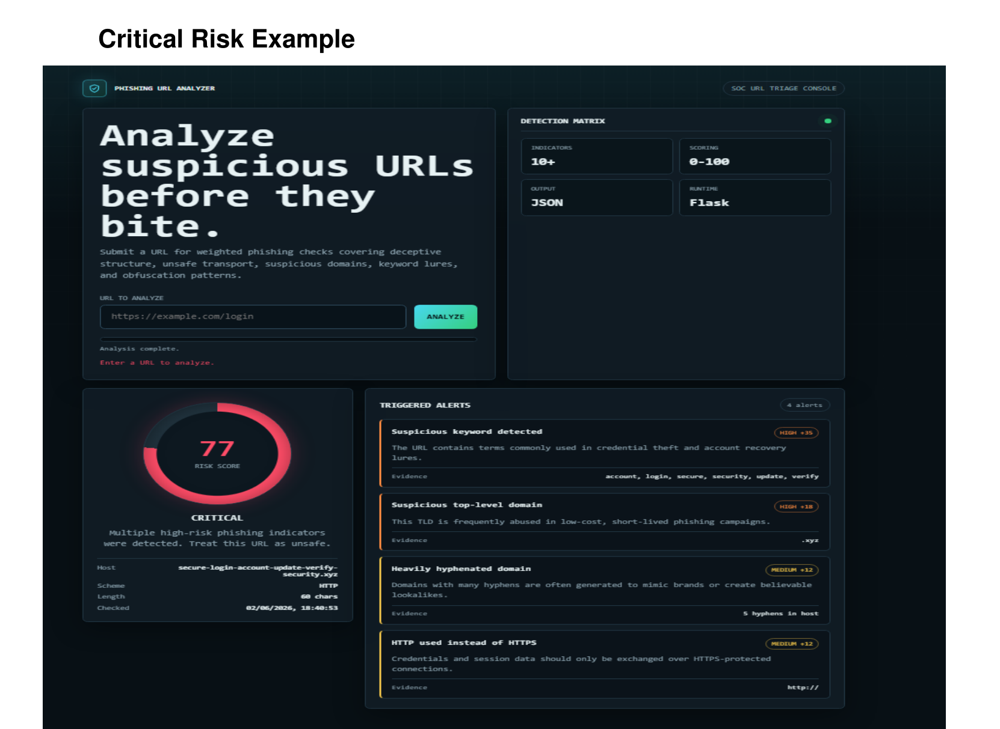
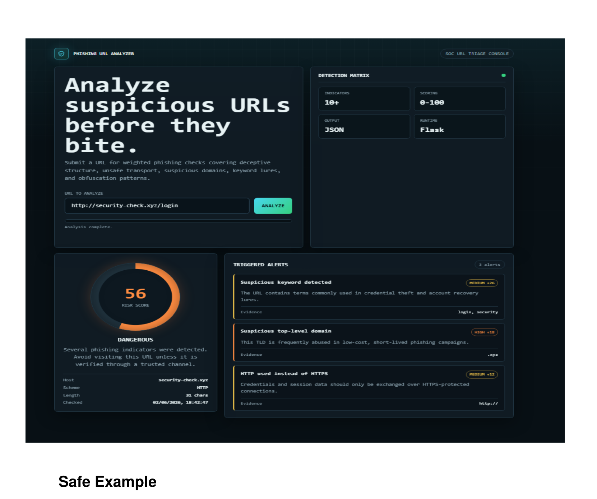
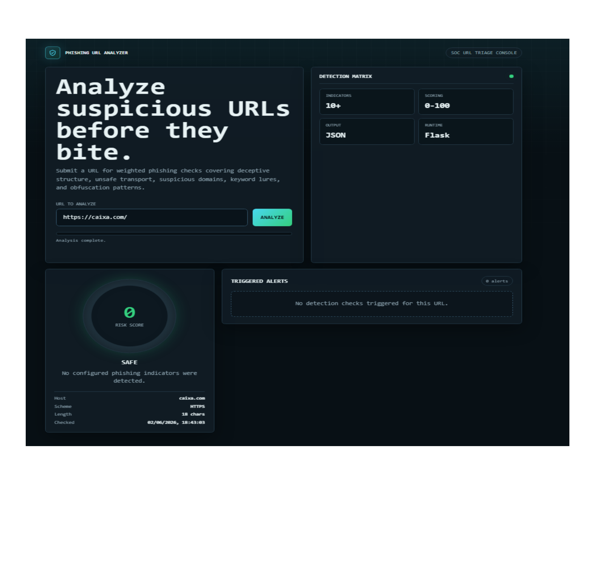

# 🎣 Phishing Detection Engine

<div align="center">


**Heuristic-based phishing URL analyzer built for cybersecurity practice and Blue Team portfolio.**

[🚀 Features](#-features) · [🔬 Detection Engine](#-detection-engine) · [📸 Screenshots](#-screenshots) · [⚙️ Installation](#️-installation)

</div>

---

## 📌 About

Phishing Detection Engine is a cybersecurity lab project that analyzes URLs in real time and identifies phishing indicators using a **weighted heuristic scoring system**.

Each indicator contributes to a **Risk Score (0–100)** that classifies the URL into one of four threat levels:

| Score | Level | Description |
|-------|-------|-------------|
| 0–25 | 🟢 **Safe** | No significant indicators detected |
| 26–50 | 🟡 **Suspicious** | Some indicators found — proceed with caution |
| 51–75 | 🟠 **Dangerous** | Multiple indicators — likely phishing |
| 76–100 | 🔴 **Critical** | High-confidence phishing — do not visit |

---

## 🚀 Features

- 🔍 **Real-time URL analysis** via Flask REST API
- 📊 **Weighted risk scoring** (0–100) with 10+ detection checks
- 🚨 **Detailed alert cards** with evidence for each triggered indicator
- 🌐 **TLD reputation analysis** — flags abused domains (`.xyz`, `.tk`, `.ml`, etc.)
- 🔑 **Suspicious keyword detection** — `login`, `verify`, `account`, `wallet`, `password`...
- 🏷️ **Typosquatting detection** — brand lookalike patterns
- 🔒 **HTTP vs HTTPS validation**
- 🔗 **Excessive hyphen detection** — common obfuscation technique
- 📱 **Responsive dark mode SOC-style dashboard**

---

## 🔬 Detection Engine

The engine evaluates URLs across multiple heuristic checks:

| Indicator | Weight | Description |
|-----------|--------|-------------|
| Suspicious Keywords | `HIGH +18` | Terms like `login`, `verify`, `update`, `wallet`, `confirm` |
| Risky TLD | `HIGH +18` | `.xyz`, `.tk`, `.ml`, `.ga`, `.cf`, `.gq`, `.top`, `.click` |
| Typosquatting | `HIGH +20` | Brand imitation using lookalike domains |
| Brand Spoofing | `HIGH +20` | Mimics well-known organizations |
| Excessive Subdomains | `MEDIUM +16` | More than 3 subdomain levels |
| HTTP Usage | `MEDIUM +12` | No HTTPS encryption |
| Excessive Hyphens | `MEDIUM +10` | More than 2 hyphens in domain |
| URL Length | `LOW +8` | Over 75 characters |
| IP Address as Host | `HIGH +20` | IP used instead of domain name |
| Encoded Characters | `MEDIUM +10` | `%20`, `//`, `@` and obfuscation patterns |

---

## 📸 Screenshots

### 🔴 Critical Risk — Score 77
> 4 indicators triggered: suspicious keywords, risky TLD, excessive hyphens, HTTP



---

### 🟠 Dangerous Risk — Score 56
> 3 indicators triggered: suspicious keywords, risky TLD, HTTP



---

### 🟢 Safe — Score 0
> 0 indicators triggered — clean URL, HTTPS, no suspicious patterns



---

## ⚙️ Installation

```bash
# Clone the repository
git clone https://github.com/nikolas-reges/phishing-detection-engine.git
cd phishing-detection-engine

# Create virtual environment
python -m venv venv
venv\Scripts\activate        # Windows
# source venv/bin/activate   # Linux/macOS

# Install dependencies
pip install flask

# Run the application
python app.py
```

Access at: **http://127.0.0.1:5003**

---

## 📁 Project Structure

```
phishing-detection-engine/
├── app.py              ← Flask backend + detection engine
├── docs/               ← Screenshots for README
│   ├── critical.png
│   ├── dangerous.png
│   └── safe.png
└── templates/
    └── index.html      ← SOC-style dark mode dashboard
```

---

## 🧪 Test URLs

```bash
# 🔴 CRITICAL — triggers 4+ indicators
http://login.verify.secure.account-update.wallet.tk/confirm?user=admin

# 🟠 DANGEROUS — typosquatting + risky TLD
http://paypal-secure-login.xyz/account/verify

# 🟢 SAFE — clean domain, HTTPS
https://github.com
```

---

## 🎯 Learning Objectives

This project was built to practice:

- 🔐 Cybersecurity detection logic and threat analysis
- 🐍 Python backend development with Flask
- 🌐 REST API design and JSON responses
- 🎨 Frontend security dashboards
- 🛡️ Heuristic-based security tooling

---

## 🔮 Future Improvements

- [ ] VirusTotal API integration for real-time threat intelligence
- [ ] WHOIS lookup — flag recently registered domains
- [ ] URL expander — resolve shortened links before analysis
- [ ] Scan history with SQLite persistence
- [ ] Browser extension version

---

## 👨‍💻 Author

**Nikolas Reges**  
Cybersecurity Student · Blue Team & Pentest · Python

[](https://linkedin.com/in/nikolas-reges-cyber)
[](https://github.com/nikolas-reges)

---

> ⚠️ **Disclaimer:** This tool is intended for educational purposes and cybersecurity portfolio demonstration only. Use responsibly.
